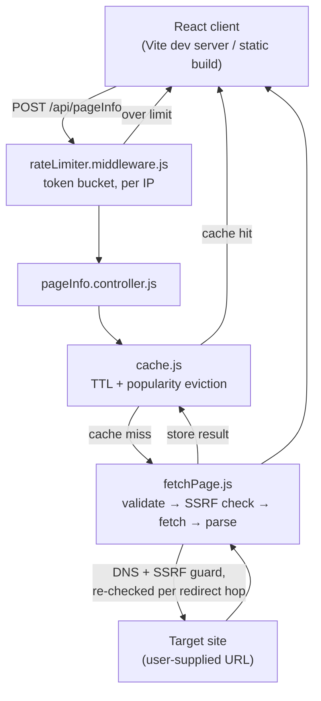

# Page Pulse

A small tool that audits any URL — paste a link, get back its HTTP status,
response time, title, meta description, H1 count, images missing `alt`
text, and an approximate word count.

**Live demo:** [add your deployed link here]
**Repo:** [add your GitHub link here]

## Why I built it this way

This started as a fairly small ask — fetch a page, pull out a few fields —
but the more I worked on it, the more it turned into a genuine exercise in
"what does a URL-fetching endpoint actually need to be safe and correct,"
not just "does it return the right JSON." A server that fetches
user-supplied URLs is a real SSRF surface, a public endpoint needs rate
limiting or it's an open invitation to abuse, and a cache needs an actual
eviction policy, not just a TTL and a prayer. Those three things ended up
being where most of my backend effort went, and they're the three design
decisions I've written up below.

On the frontend, I wanted the tool to actually look like what it's named
after — "Page Pulse" reporting a page's vitals felt like it should read
as a diagnostic readout, not another card-with-an-input-box demo. So the
UI leans into an ECG/monitor aesthetic: a scrolling pulse line that
changes color and speed with request state, and a report card styled
like a lab printout.

## Tech stack

**Backend**
- Node.js, Express
- Cheerio for server-side HTML parsing (no headless browser)
- Axios as the HTTP client
- Hand-written in-memory token-bucket rate limiter
- Hand-written in-memory cache with TTL + frequency-based eviction
- Jest for testing

**Frontend**
- React + Vite
- Plain CSS (no UI library) — `IBM Plex Mono` for data/labels, `IBM Plex Sans`
  for body text
- No extra dependencies beyond React/Vite itself — just `fetch`, component
  state, and hand-written SVG for the pulse animation

No database. No Redis. That's a deliberate call, not an oversight —
explained in design decision #3 below.

## Architecture



Request flow: every request passes through the rate limiter first, since
that's the cheapest check and should reject abusive traffic before any
other work happens. A cache hit short-circuits straight back to the
client. On a miss, `fetchPage.js` resolves and SSRF-checks the hostname,
follows redirects one hop at a time (re-checking SSRF on each hop), fetches
the page, and hands the HTML to the parser — the successful result is
then written back into the cache before the response goes out.

## Project structure

```
.
├── client
│   ├── index.html
│   ├── vite.config.js          # dev-server proxy to the backend
│   ├── .env.example
│   ├── public/
│   │   ├── favicon.svg
│   │   └── icons.svg
│   └── src
│       ├── main.jsx
│       ├── App.jsx             # owns state, talks to the API
│       ├── App.css
│       ├── index.css           # tokens, fonts, reset
│       └── components/
│           ├── PulseWaveform.jsx   # the signature animated ECG line
│           ├── UrlForm.jsx
│           ├── ReportCard.jsx
│           ├── StatCard.jsx
│           └── ErrorNotice.jsx
│
└── server
    ├── src
    │   ├── index.js             # entry point
    │   ├── app.js                # express app setup
    │   ├── controller/
    │   │   └── pageInfo.controller.js
    │   ├── middleware/
    │   │   └── rateLimiter.middleware.js
    │   ├── route/
    │   │   └── pageInfo.route.js
    │   ├── script/
    │   │   ├── fetchPage.js      # validation, SSRF guard, redirects, parsing
    │   │   └── cache.js          # TTL + popularity-aware in-memory cache
    │   └── utils/
    │       ├── ApiError.js
    │       ├── ApiResponse.js
    │       └── asyncHandler.js
    └── tests/
        └── parseReport.test.js
```

## Setup

**Backend**

```bash
cd server
npm install
npm start        # runs on http://localhost:3000 by default
```

**Frontend** (in a separate terminal)

```bash
cd client
npm install
npm run dev       # runs on http://localhost:5173
```

`vite.config.js` proxies `/api` requests from the dev server straight to
the backend, so no `.env` is needed for local development. Requires
Node 18+ on both sides.

Run the backend tests:

```bash
cd server
npm test
```

## API contract

### `POST /api/pageInfo`

**Request body**

```json
{ "url": "https://example.com" }
```

**Success — `200 OK`**

```json
{
  "statusCode": 200,
  "data": {
    "url": "https://example.com/",
    "httpStatus": 200,
    "responseTimeMs": 94,
    "title": "Example Domain",
    "metaDescription": null,
    "h1Count": 0,
    "imagesTotal": 0,
    "imagesMissingAlt": 0,
    "wordCount": 24,
    "cached": false
  },
  "message": "Page fetched successfully",
  "success": true
}
```

`title` and `metaDescription` are `null` when the page genuinely doesn't
have one — that's a valid result, not an error (`example.com` above is a
real example of this, not a hypothetical). `cached` tells you whether
this response came from the in-memory cache or a fresh fetch; it's not
part of the original spec, but it made it much easier to actually
demonstrate the caching layer working rather than just describing it.

`url` in the response is the **final resolved URL** after following
redirects, not necessarily what you sent — if you audit
`http://example.com`, and it redirects to `https://example.com/`, the
report reflects the page that was actually loaded.

**Errors** — always this shape, never a raw stack trace:

```json
{
  "statusCode": 400,
  "data": null,
  "message": "\"not a url\" is not a valid URL",
  "success": false
}
```

| Status | When |
|---|---|
| 400 | Missing/empty URL, unparseable URL, unsupported protocol (e.g. `ftp://`), or the URL resolves to a private/internal address |
| 415 | The URL resolves but returns a non-HTML `content-type` |
| 429 | Rate limit exceeded for this IP |
| 502 | DNS failure, connection refused, unreachable, or too many redirect hops |
| 504 | No response within the timeout window |

A page that loads fine but returns a non-2xx status (a 404 page, say) is
**not** treated as an error — it's still HTML, still gets parsed, and the
report includes `httpStatus: 404` so the caller can see that for
themselves. Only things that stop a report from being produced at all are
errors.

## Design decisions

### 1. The server validates and re-validates against SSRF, including on every redirect hop

A server that fetches a URL a user supplies is a textbook SSRF surface —
nothing stops someone from pointing it at `169.254.169.254` (a cloud
metadata endpoint) or an internal service on `localhost`. I resolve the
hostname via DNS and check the actual IP against private/internal ranges
before fetching, not just the hostname string.

The part I almost got wrong: my first fix was `maxRedirects: 0`, which
closes the SSRF gap but also breaks completely normal things like
`http://` → `https://` upgrades, since axios throws on any redirect at
all. The actual fix was following redirects manually, one hop at a time,
re-running the SSRF check on every new hostname before following it —
not just on the original URL. That way a malicious 301 mid-chain gets
caught at the point it's about to be followed, and legitimate redirects
still work.

### 2. Caching is global and keyed by normalized URL, with TTL *and* popularity both deciding evictions

Global, not per-user — the report for a given URL doesn't depend on who's
asking, so a per-user cache would just store the same data multiple times
for zero benefit. URLs are normalized (lowercased host, trailing slash
stripped, fragment dropped) so equivalent URLs share one cache entry.

TTL alone felt insufficient: it treats a URL hit 200 times the same as
one hit once, right up until both expire together. So evictions (when the
cache is full) prefer removing the least-*popular* entry, not just the
oldest one — but TTL still caps every entry's absolute lifetime
regardless of popularity, because an audit tool reporting a 9-minute-old
"live" snapshot defeats the point. I'm aware this isn't a perfectly
correct LFU — hit counts never decay over time, so a URL that was popular
a while ago can still outrank one that just started trending if eviction
happens to land in between. I left that as a known limitation rather than
implementing count decay, since the TTL cap already bounds how much that
can matter in practice.

### 3. No Redis, no database — deliberately, not by omission

Both the cache and the rate limiter are in-memory. That's specifically
because this runs as a single server instance, and in-memory state has
nowhere else it needs to be consistent with. The moment this runs on more
than one instance, in-memory state breaks silently — two instances would
have two separate counters and two separate caches, so a user could get
rate-limited on one instance and simply not on the other, and cache hits
would depend on which instance you happened to land on. Redis fixes that
by giving every instance a shared source of truth, but adding it now
would be solving a scaling problem I don't currently have, at the cost of
real deployment complexity. I built the rate limiter as a token bucket
specifically (not a fixed-window counter) because a fixed window has a
boundary-burst problem — a user can max out requests right before a
window resets and immediately burst again right after. A token bucket,
where capacity refills continuously instead of all at once, closes that
gap without needing Redis to do it.

## Testing

`server/tests/parseReport.test.js` unit-tests the parsing logic directly,
with no network involved. It covers one happy-path block, two
failure-case blocks (a page with no metadata at all, and malformed/empty
HTML), and one extra block for the `og:description` fallback, since
that's a real branch in the code a pure happy-path test wouldn't
exercise. I did not write tests for `fetchPage` itself or the
SSRF/redirect logic, since testing those properly needs network mocking —
I judged that out of scope for the time I had, and the task specifically
asked for tests on the parsing logic.

## Scale assumptions

I didn't have real traffic data to design against, so here are the
assumptions I made explicit rather than silently baked in:

- **Usage pattern**: a portfolio/demo tool, not a paying SaaS product —
  low thousands of daily active users at most, usage spiky around a
  specific moment (shared somewhere, or someone re-checking after a fix)
  rather than steady load.
- **Access pattern**: I'm assuming a handful of URLs get hit repeatedly
(a re-check after a fix, a briefly popular link) while most are
one-off, which is exactly why caching and the rate limiter already
pay off even at small scale.

**Current capacity (single free-tier instance, in-memory cache + limiter):**
Roughly 50–100 concurrent in-flight audits before RAM/connection limits
on a typical free-tier instance (~512MB, shared CPU) become the
bottleneck, and ~10–20 requests/sec sustained, bounded by average
external fetch time. In practice this comfortably supports low thousands
of daily users doing occasional checks — the one real weak spot is many
people hitting many *different, uncached* URLs in the same second, which
isn't the common case here.

**Capacity after the future-scope items below:** roughly linear in
instance count once horizontally scaled, plus request coalescing turning
a URL going viral (thousands of people auditing the same link at once)
into a single origin fetch instead of thousands. That combination is
what actually unlocks tens of thousands of daily users, not more
hardware alone, but closing the one scenario the current design is
weakest against.

## Known limitations / what I'd change with another day

- No request coalescing — if many users hit the same uncached URL at the
  exact same moment, each one triggers its own origin fetch instead of
  sharing one in-flight request. This is the single biggest gap between
  current and future-scope capacity (see Scale assumptions above).
- Single instance only — the in-memory cache and rate limiter don't sync
  across multiple servers, so horizontal scaling would need a shared
  store (Redis) before it's safe to run more than one instance.
- No CDN in front of the API — since the endpoint is a POST, it isn't
  edge-cacheable as-is; switching to a `GET /api/pageInfo?url=` variant
  would let a CDN cache repeated lookups without the request ever
  reaching the server.
- Hit counts in the cache don't decay over time (see design decision #2).
- The in-memory rate limiter and cache's `Map`s grow with every distinct
  IP/URL seen and are never swept — a non-issue at this scale, but a
  production version would need periodic cleanup or a move to Redis with
  TTL-based expiry.
- No tests around `fetchPage`'s network/SSRF/redirect behavior — would
  add these with mocked DNS/HTTP responses given more time.
- No support for auditing multiple URLs in one request (e.g. a sitemap) —
  would need to move off a synchronous request/response model into a job
  queue for that.
- The frontend shows one report at a time with no history — a "recent
  checks" list would be a natural next addition.

## Where I used AI

I used Claude throughout this project as a thinking partner, mainly for
the parts I hadn't built before — I went in knowing the shape I wanted on
the backend, but used it to catch mistakes in my own code and to learn
things I genuinely didn't know, like SSRF being a real concern for a
URL-fetching server at all. The clearest example of me actually pushing
back rather than accepting the first answer: I was initially given a
fixed-window rate limiter, and when I asked how the refill actually
worked, I realized it had a boundary-burst flaw, so I asked for a true
token bucket instead. Similarly, for caching, I knew I wanted both a time
limit and popularity to matter together, and worked through what that
actually meant instead of taking a single suggestion at face value.

The frontend is where I leaned on AI the most directly — I asked for a
design that fit the tool's name rather than a generic form-and-card
layout, and got the ECG/pulse-line concept, the component breakdown, and
the styling. I reviewed the components, adjusted them to fit my actual
API's response shape, and tested it against my real backend before
accepting it.


## Coding Style: 

A note on the `utils/` folder (`ApiError`, `ApiResponse`, `asyncHandler`):
this is a standard Express boilerplate pattern I already use across my
own projects, not something written specifically for this assignment. I
brought my usual project skeleton in and built the audit-specific logic
(`fetchPage.js`, `cache.js`, the rate limiter, the controller) on top of
it, the same way I'd start any Express backend.